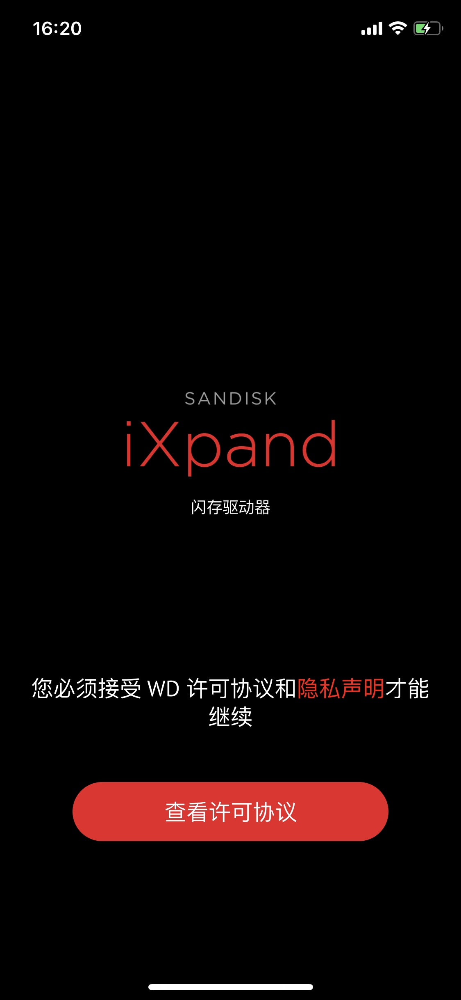
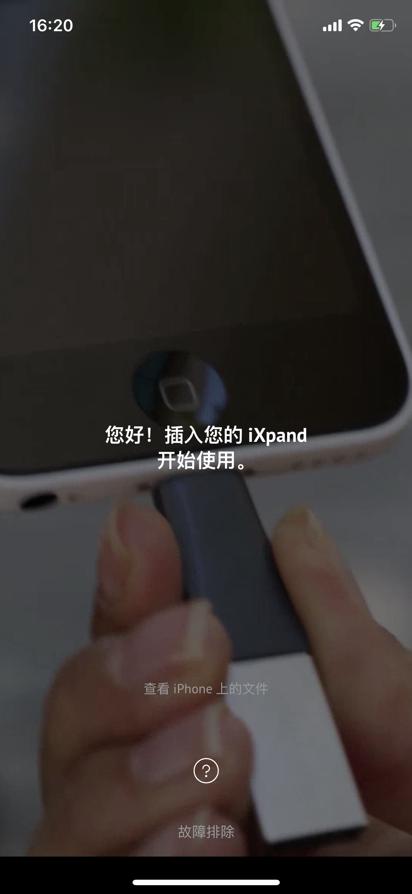
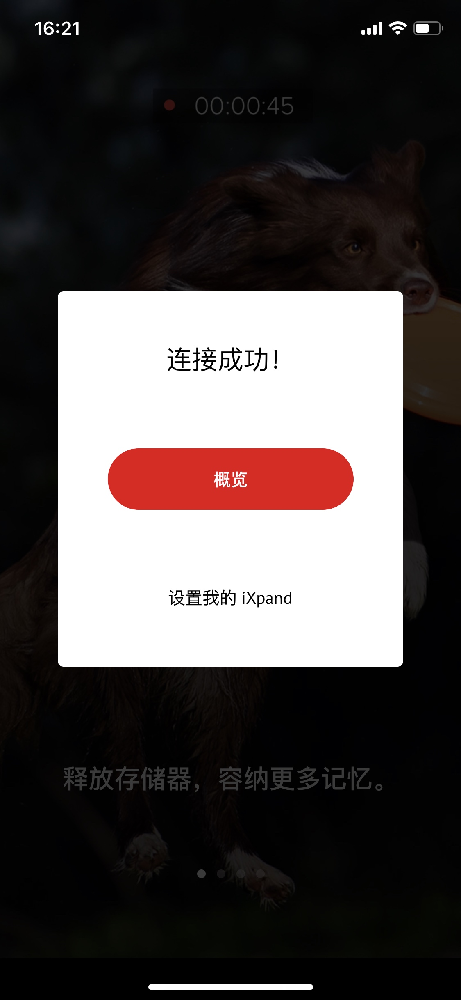
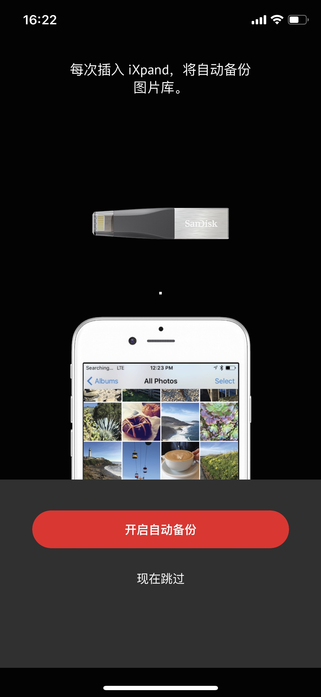
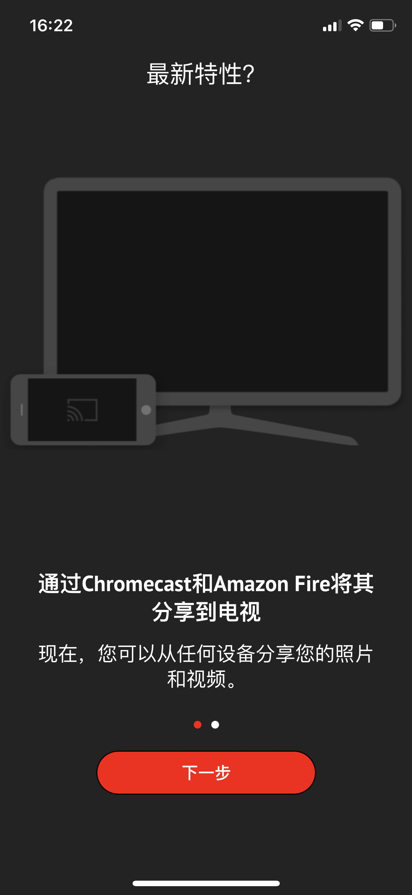
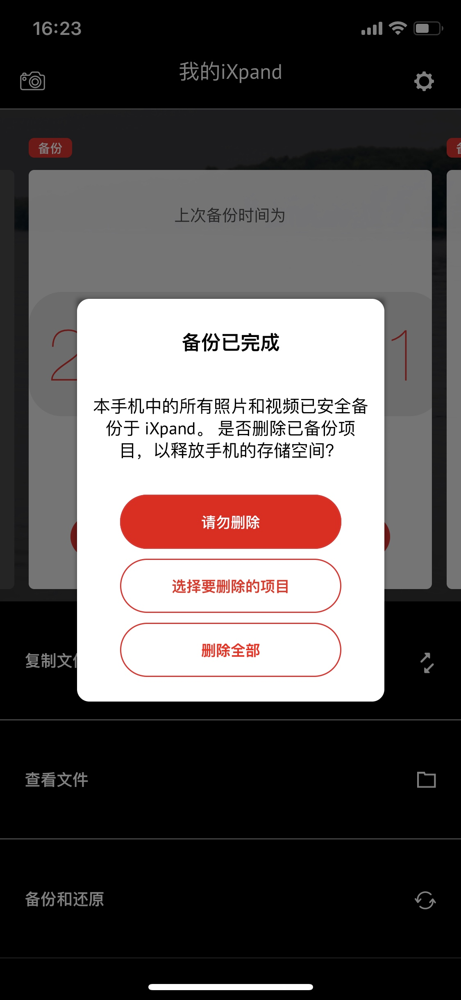
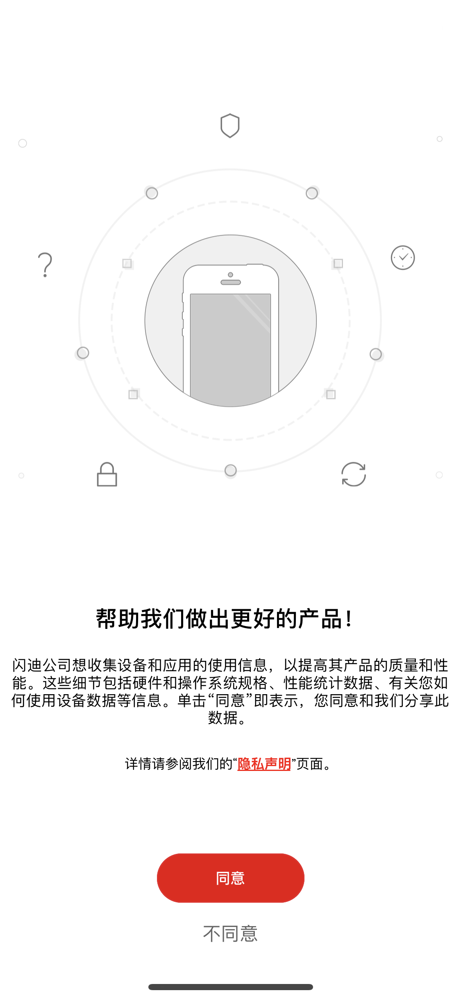

# 闪迪Iphone 手机U盘使用小手册

## 简介

这不是一个普通的U盘！这不是一个普通的U盘！！这不是一个普通的U盘！！！

这个U盘会给生活带来很大便利。

首先直接插入手机，就可以实现备份，而且是按照时间顺序排列，每个月份自动创建一个文件夹。

其次这个支持增量备份，每次照了新照片，只同步新的照片到 U 盘中。这给我查找和打印照片带来了很多方便，也不怕手机丢失而导致的珍贵照片丢失。

具体操作步骤如下，先读完一遍，然后按照步骤再操作。整个过程大约只需要半个小时。

## 第一步 下载手机App

在 ``Apple Store`` 下载手机软件： ``iXpand Drive``

## 第二步 备份手机图片到U盘

### 1. 打开App
进入下图

### 2. 点击：查看许可协议
进入下图

### 3. 点击：接受
进入下图

### 4. 选择第二个

选择好U盘后，会进入如下页面

### 5. 插入U盘到手机上

等待一段时间后，出现如下页面：

### 6. 点击：设置我的iXpand

进入下图

### 7. 点击：开启自动备份

进入下图，App会要照片和视频的访问权限

### 8. 点击：允许

允许App访问照片和视频的访问权限之后，这个时候App就会开始将手机中的照片和视频备份到U盘中了。

点击允许后，进入下面的页面：

如果出现这个页面，点击：下一步

### 9. 点击：下一步 （如果有这个页面的话）

进入App主页面，如下图：

### 10.注意！注意！注意！备份完成

备份完成后，会看到如下页面：

阅读提示后，三个选项根据你自己的需要选择即可。

### 11. 隐身声明

如果出现下面的页面，直接点击不同意

## 第三步 在电脑上查看图片

### 1. 将U盘查到电脑上

打开U盘如下

备份的照片就在红色框的目录里面，如下图：

### 2. 文件管理

插入U盘后就可以管理照片了。除了上面红色框的目录，其他的文件看你自己需要都可以删掉。
