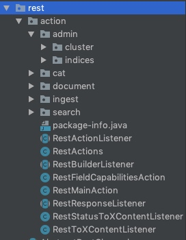

---

## 前言

在上一篇文章[搜索引擎ElasticSearch的启动过程](http://lanffy.github.io/2019/04/09/ElasticSearch-Start-Up-Process)中，介绍了ES的启动过程。

由此可知，在ES启动过程中，创建Node对象（new Node(environment)）时，初始化了RestHandler，由其名字可以知道这是用来处理Rest请求的。

在ES源码中，RestHandlerAction如下图：

其中：

* admin
    * cluster：处理集群相关请求
    * indices：处理索引相关请求
* cat：日常查询
* document：文档处理
* ingest：pipeline处理。pipeline？干嘛的
* search：搜索

接下来我们具体的看一下ES是如何创建索引的：``org.elasticsearch.rest.action.document.RestIndexAction``

## 数据概念和结构
一个完整的ES集群由以下几个基本元素组成

* Cluster
    * node
    * index
    * type
    * document
    * field
    * mapping：用来约束文档字段的类型，可以理解为索引内部结构
    * shard：分片，数据存储的载体，是ES数据存储的最小单位

一个ES集群的结构如下：

一个索引的内部结构：

说明：ES 6.x 版本中，相同索引只允许一个type，不再支持多个type。7.x版本中，type将废弃。

