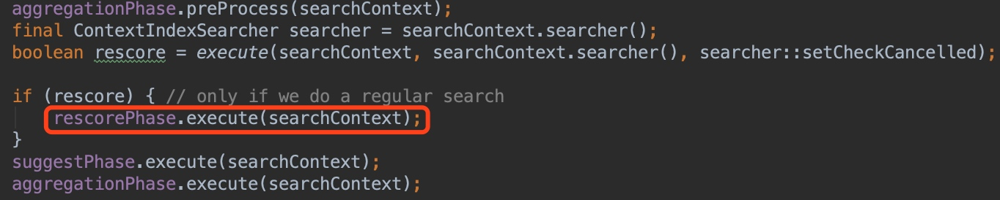

---

## 前言

说明：本文章使用的ES版本是：``6.7.0``

在上一篇文章[Elasticsearch如何创建索引?](https://lanffy.github.io/2019/04/16/How-Elasticsearch-Create-Index)中，介绍了ES写入文档的过程。

接下来我们具体的看一下ES中，搜索过程是怎样的

## 系列文章

1. [搜索引擎ElasticSearch源码编译和Debug环境搭建](https://lanffy.github.io/2019/04/08/Elasticsearch-Compile-Source-And-Debug)
2. [搜索引擎ElasticSearch的启动过程](https://lanffy.github.io/2019/04/09/ElasticSearch-Start-Up-Process)
3. [Elasticsearch如何创建索引?](https://lanffy.github.io/2019/04/16/How-Elasticsearch-Create-Index)

## 在ES中搜索

按照前面几篇文章的步骤，我们直接开始debug搜索的过程。[上一篇文章](https://lanffy.github.io/2019/04/16/How-Elasticsearch-Create-Index)中我们写入了如下的数据

```json
{
    "id":6,
    "title": "我是文件标题，可被搜索到66",
    "text":  "文本内容，ES时如何索引一个文档的66",
    "date":  "2014/01/06"
}'
```

现在执行如下请求，对ES服务器发起搜索请求：

```
curl -X GET 'localhost:9200/index_name/type_name/_search?pretty&q=title:66' -H 'Content-Type: application/json'
```

搜索可以接收下面的形式的请求：


### 客户端

1. 根据路由，RestSearchAction接收并开始处理请求
2. RestSearchAction解析并验证搜索参数，并将其封装成SearchRequest，并指定服务端要处理该请求的Action：indices:data/read/search

### 服务端（master节点）

1. 根据SearchRequest的index构造相应的ShardsIterator（分片迭代器），shardIterators由localShardsIterator（当前节点分片迭代器（默认一个节点上，一个索引有5个分片））和remoteShardIterators（其他节点分片迭代器）合并而成，根据搜索条件，构建搜索策略。然后遍历所有的shard。
    * 搜索策略
        * 最多遍历分片数量LONG最大值2^63-1
        * 如果只有一个分片，搜索类型只能是：QUERY_THEN_FETCH
        * 是否查询缓存
        * 遍历分片的最大并发数Math.min(256, Math.max(节点数, 1)*节点分片数)，节点默认分片数：5
2. 构造异步请求Action，将请求转发到各个节点，等待回调
3. 遍历所有节点，构造节点查询参数ShardSearchTransportRequest对象，对每个节点执行查询操作
4. 执行查询阶段，首先在cache里面判断是否有缓存，如果有则执行缓存查询；如果cache里面没有，执行QueryPhase类的execute()方法，他调用lucene的searcher.search对索引进行查询，查询成功回调onShardResult方法并返回docIds，查询失败回调onShardFailure（计数失败情况，并尝试在副本分片上进行查询）
5. 查询阶段会计算文档的相关性得分用于排序：

6. Fetch阶段：master接收到各个节点返回的docIds后，发起数据Fetch请求，通过docId和其分片ID到对应分片抓取数据，后合并数据返回给客户端


大致的查询时序逻辑：


